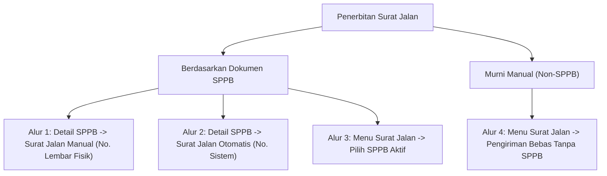

# 📦 E-SPPB Enterprise (v1.0.0)

> **Elektronik Surat Permintaan & Pelepasan Barang (E-SPPB)** — Sistem enterprise modern multi-plant untuk manajemen siklus hidup pengajuan pengeluaran barang, persetujuan berjenjang (*multi-stage workflow engine*), penerbitan Surat Jalan (*Goods Release*) dengan 4 alur pengiriman, verifikasi digital publik berbasis enkripsi SHA-256, serta pelaporan enterprise komprehensif berbasis **Laravel 12** (PHP 8.3+) & **Filament v5**.

---

## 📋 Daftar Isi
1. [Gambaran Umum & Arsitektur](#-gambaran-umum--arsitektur)
2. [Teknologi Utama (Tech Stack)](#-teknologi-utama-tech-stack)
3. [Fitur Utama Sistem](#-fitur-utama-sistem)
4. [4 Alur Penerbitan Surat Jalan (Goods Release)](#-4-alur-penerbitan-surat-jalan-goods-release)
5. [Standar RESTful API & Response Envelope](#-standar-restful-api--response-envelope)
6. [Struktur Role & Hak Akses (RBAC)](#-struktur-role--hak-akses-rbac)
7. [Daftar Endpoint API v1](#-daftar-endpoint-api-v1)
8. [Laporan Enterprise & Audit Trail](#-laporan-enterprise--audit-trail)
9. [Microservice WhatsApp Gateway](#-microservice-whatsapp-gateway)
10. [Panduan Instalasi & Deployment](#-panduan-instalasi--deployment)
11. [Pengujian & Quality Gate (Test Suite)](#-pengujian--quality-gate-test-suite)
12. [Informasi Rilis v1.0.0 & Repositori](#-informasi-rilis-v100--repositori)

---

## 🌟 Gambaran Umum & Arsitektur

**E-SPPB Enterprise** mengotomatiskan seluruh alur logistik internal dan perpindahan aset antar-plant pada lingkungan industri dan manufaktur berskala besar. Sistem dirancang dengan standar keamanan tinggi:

- **Enkripsi Kriptografi SHA-256**: Generasi `verification_hash` dan `sha256_token` unik untuk setiap lembar dokumen resmi.
- **Verifikasi Publik Tanpa Login**: Halaman verifikasi publik (`/verify/document/{hash}`) dengan *Dynamic QR Code* untuk pembuktian keaslian dokumen secara instan oleh pihak sekuriti atau vendor.
- **Pessimistic Concurrency Locking**: Penguncian record level database (`lockForUpdate()`) untuk penomoran otomatis (*Running Number*) dan alur persetujuan bebas konflik.
- **Integritas Audit Trail Komprehensif**: Pencatatan riwayat perubahan status dokumen (`sppb_status_logs`), delegasi wewenang, serta log akses dokumen lintas plant.

---

## 🛠️ Teknologi Utama (Tech Stack)

| Komponen | Teknologi | Versi | Keterangan |
| :--- | :--- | :--- | :--- |
| **PHP Runtime** | PHP | `^8.3` | Typed properties, match expressions, constructor promotion |
| **Framework Utama** | Laravel Framework | `v12.x` | Streamlined bootstrap, native eager limit |
| **Admin Panel UI** | Filament Admin | `v5.x` | Modern reactive dashboard & components |
| **Frontend Engine** | Livewire | `v4.x` | Real-time reactive interaction |
| **CSS Framework** | Tailwind CSS | `v4.x` | Modern utility-first styling |
| **Database Engine** | MySQL / MariaDB | `8.0+` / `10.11+` | ACID transaction, JSON & Foreign Keys |
| **Otentikasi API** | Laravel Sanctum | `v4.x` | Bearer Token & SPA Session Auth |
| **Role & Permission** | Spatie Laravel Permission | `v8.x` | Multi-role RBAC (267 Permissions) |
| **PDF Generation** | Dompdf / Browsershot | `v3.x` | Cetakan presisi A4 standar industri |
| **Code Formatter** | Laravel Pint | `v1.x` | PSR-12 & Laravel Code Style |
| **Testing Suite** | PHPUnit | `v11.x` | 203 Test Cases / 678 Assertions (100% Pass) |
| **WA Gateway** | Node.js Express + `whatsapp-web.js` | Port `3000` | Microservice notifikasi WhatsApp |

---

## 🚀 Fitur Utama Sistem

### 1. 📄 Modul SPPB (Surat Permintaan Pengeluaran Barang)
- **Autocomplete Master Data**: Pencarian otomatis data Barang (*Items*), Aset (*Assets*), Satuan (*Units*), dan Lokasi (*Locations*).
- **Auto Running Number Generator**: Penomoran format standar perusahaan terisolasi unik per Plant, Departemen, dan Periode Bulan/Tahun.
- **Validasi Integritas**: Validasi ketat pencegahan lokasi asal dan tujuan yang sama, serta pembatasan kuantitas sisa rilis.
- **Pratinjau & Cetak PDF A4**: Dilengkapi Kop Perusahaan resmi, tabel rincian multi-item, tanda tangan digital approver, dan QR Code verifikasi.

### 2. ⚡ Multi-Stage Workflow Approval Engine
- **Hierarki Persetujuan Multi-Level**: Otorisasi terstruktur dari Pemohon $\rightarrow$ Atasan Langsung (Supervisor) $\rightarrow$ Kepala Departemen (Manager) $\rightarrow$ Verifikator Bagian Aset Tetap (BAT).
- **Tindakan Persetujuan Interaktif**:
  - `Setujui (Approve)`: Meneruskan berkas ke approver berikutnya.
  - `Minta Revisi (Revision)`: Mengembalikan dokumen ke pemohon dengan catatan perbaikan tanpa membatalkan transaksi.
  - `Tolak (Reject)`: Menolak pengajuan secara final disertai alasan penolakan.
- **Delegasi Wewenang**: Pelimpahan hak persetujuan sementara (saat cuti/tugas luar) dengan masa berlaku terprogram.
- **Kotak Masuk Persetujuan (*My Approvals*)**: Panel khusus untuk meninjau dan mengeksekusi tugas persetujuan secara cepat.

### 3. 🛡️ Modul Recycle Bin & Soft Deletes
- Panel khusus Super Admin untuk memulihkan (*Restore*) atau menghapus permanen (*Force Delete*) data SPPB dan Surat Jalan yang terhapus.

---

## 🚚 4 Alur Penerbitan Surat Jalan (Goods Release)

Sistem mengimplementasikan **4 Alur Penerbitan Surat Jalan** yang fleksibel dan presisi:



1. **Alur 1: Detail SPPB $\rightarrow$ Kirim Barang $\rightarrow$ "Surat Jalan Manual"**
   - **Konteks**: Pengiriman tetap terikat pada dokumen SPPB bersangkutan.
   - **No. Surat Jalan**: Admin menginput No. Surat Jalan Manual (`manual_release_number`) dari lembar fisik sebagai nomor utama, sedangkan nomor otomatis sistem menjadi nomor referensi.
   - **Tampilan & PDF**: Menampilkan Seksi Info SPPB dan tabel kalkulasi kuantitas SPPB (Awal, Terkirim, Qty Kirim Ini, Sisa SPPB).

2. **Alur 2: Detail SPPB $\rightarrow$ Kirim Barang $\rightarrow$ "Surat Jalan Otomatis"**
   - **Konteks**: Pengiriman 100% otomatis ditarik dari sisa kuantitas item SPPB dengan nomor surat jalan otomatis sistem (`release_number`).

3. **Alur 3: Daftar Surat Jalan $\rightarrow$ Buat Surat Jalan $\rightarrow$ "Surat Jalan SPPB"**
   - **Konteks**: Pembuatan surat jalan berbasis SPPB dari menu utama, di mana admin memilih dokumen SPPB yang telah disetujui dari *dropdown*.

4. **Alur 4: Daftar Surat Jalan $\rightarrow$ Buat Surat Jalan $\rightarrow$ "Surat Jalan Manual" (Non-SPPB)**
   - **Konteks**: Pengiriman bebas yang murni tanpa dasar SPPB (`sppb_header_id = null`).
   - **Fleksibilitas Input**: Admin bebas menginput Nama Pengirim, Penerima, Nama Barang Bebas, Jenis (`Non Asset` / `Asset`), Barcode/Kode Seri opsional, Qty Kirim, dan Satuan via Dropdown Master Unit.
   - **Tampilan & PDF**: Seksi Info SPPB disembunyikan otomatis, penomoran seksi dinamis (1 s.d 5), dan tabel barang menyajikan tabel ringkas 6-kolom.

---

## 🌐 Standar RESTful API & Response Envelope

Seluruh endpoint REST API v1 merespons format JSON standar yang konsisten:

### Response Sukses (`HTTP 200 OK / 201 Created`):
```json
{
  "success": true,
  "message": "Operasi berhasil dieksekusi",
  "data": { ... },
  "meta": {
    "current_page": 1,
    "per_page": 15,
    "total": 50,
    "last_page": 4
  }
}
```

### Response Error (`HTTP 400 / 401 / 403 / 404 / 422 / 500`):
```json
{
  "success": false,
  "message": "Deskripsi kesalahan validasi / otorisasi",
  "errors": {
    "field_name": ["Detail pesan kesalahan validasi"]
  }
}
```

---

## 🔒 Struktur Role & Hak Akses (RBAC)

Aplikasi memiliki **8 Peran Resmi** berbasis Spatie Laravel Permission dan **267 Permission** granular:

| Peran / Role | Deskripsi & Hak Akses |
| :--- | :--- |
| **`super_admin`** | Super Administrator (Akses Penuh 267 Permissions, Konfigurasi Sistem, & Recycle Bin). |
| **`admin`** | Administrator Sistem (Akses Penuh Operasional Master Data & Manajemen Pengguna). |
| **`Pemohon`** | Pemohon SPPB (Membuat draft, mengajukan, mengedit revisi, dan mengunggah lampiran). |
| **`Supervisor`** | Atasan Langsung (Menyetujui/menolak SPPB level 1 & mengatur delegasi wewenang). |
| **`Manager`** | Kepala Departemen (Persetujuan SPPB level Manager & pemantauan KPI departemen). |
| **`BAT Verifier`** | Verifikator Bagian Aset Tetap (Pemeriksaan & persetujuan barang bernilai aset). |
| **`Sekuriti/Gudang`** | Petugas Eksekusi Lapangan (Penerbitan Surat Jalan, pelepasan barang, & konfirmasi e-POD). |
| **`Auditor`** | Auditor Internal (*Read-Only* seluruh transaksi, laporan enterprise, dan log audit trail). |

---

## 📡 Daftar Endpoint API v1

### 🔑 Autentikasi & Akun
- `POST /api/v1/auth/login` — Login pengguna via Email/NIK & Password.
- `POST /api/v1/auth/logout` — Logout dan pembatalan token Sanctum.
- `GET /api/v1/auth/me` — Ambil informasi profil akun dan daftar permissions aktif.

### 📄 Pengelolaan SPPB
- `GET /api/v1/sppb` — Daftar SPPB dengan filter status, plant, dan paginasi.
- `POST /api/v1/sppb` — Pembuatan dokumen SPPB baru.
- `GET /api/v1/sppb/{uuid}` — Detail dokumen SPPB, rincian barang, dan lampiran.
- `PUT /api/v1/sppb/{uuid}` — Pembaruan SPPB status Draft / Revisi.
- `DELETE /api/v1/sppb/{uuid}` — Penghapusan dokumen SPPB (Soft Delete).
- `POST /api/v1/sppb/{uuid}/submit` — Pengajuan SPPB ke workflow persetujuan.
- `POST /api/v1/sppb/{uuid}/cancel` — Pembatalan pengajuan SPPB.
- `GET /api/v1/sppb/{uuid}/status-logs` — Riwayat log audit perubahan status SPPB.
- `GET /api/v1/sppb/{uuid}/releasable-items` — Daftar sisa kuantitas item yang dapat dirilis.

### ⚡ Workflow & Persetujuan
- `GET /api/v1/workflow/tasks` — Daftar antrean tugas persetujuan milik approver aktif.
- `POST /api/v1/workflow/steps/{stepId}/approve` — Eksekusi persetujuan langkah workflow.
- `POST /api/v1/workflow/steps/{stepId}/reject` — Eksekusi penolakan pengajuan.
- `POST /api/v1/workflow/steps/{stepId}/revision` — Permintaan revisi dokumen ke pemohon.

### 🚚 Surat Jalan & e-POD
- `GET /api/v1/goods-releases` — Daftar dokumen Surat Jalan.
- `POST /api/v1/goods-releases` — Penerbitan Surat Jalan baru (SPPB / Manual).
- `GET /api/v1/goods-releases/{uuid}` — Detail lengkap Surat Jalan.
- `POST /api/v1/goods-releases/{uuid}/receive` — Konfirmasi penerimaan barang (*e-POD*).

### 🔍 Verifikasi Publik
- `GET /verify/document/{hash}` — Halaman verifikasi publik keabsahan dokumen via SHA-256 token.

---

## 📊 Laporan Enterprise & Audit Trail

Tersedia **6 Modul Laporan Enterprise** dengan filter multi-parameter dan ekspor data (Excel/CSV/PDF):
1. **Laporan SPPB**: Rekapitulasi status pengajuan pengeluaran barang lintas plant.
2. **Laporan Pemenuhan Item SPPB**: Analisis perbandingan kuantitas diminta vs kuantitas terkirim.
3. **Laporan Pencarian Surat Jalan**: Pelacakan dokumen pengiriman barang berdasarkan kendaraan, driver, dan nomor surat jalan.
4. **Laporan Riwayat Perpindahan Aset**: Jejak audit mutasi aset fisik antar lokasi dan pabrik.
5. **Laporan Diskrepansi Penerimaan Barang**: Rekapitulasi selisih barang kirim vs barang terima pada titik e-POD.
6. **Laporan Log Validasi Dokumen**: Audit catatan pemindaian QR Code dan verifikasi publik.

---

## 📱 Microservice WhatsApp Gateway

Terletak pada direktori `/whatsapp-gateway` berbasis Node.js Express & `whatsapp-web.js`:

```bash
cd whatsapp-gateway
npm install
npm run dev # Berjalan di port 3000
```
- **Integrasi Panel**: Status koneksi WhatsApp dan QR Code pairing dapat dipantau langsung melalui Admin Panel Filament (`Pengaturan Notifikasi`).

---

## ⚙️ Panduan Instalasi & Deployment

### 1. Kloning & Persiapan Dependensi
```bash
git clone https://github.com/bayusasongko2407/e-sppb.git
cd e-sppb
composer install --no-dev --optimize-autoloader
cp .env.example .env
php artisan key:generate
```

### 2. Migrasi & Seeder Database
```bash
php artisan migrate --seed --force
```

### 3. Kompilasi Aset Frontend
```bash
npm install
npm run build
```

### 4. Optimasi Cache Produksi
```bash
php artisan optimize
```

---

## 🧪 Pengujian & Quality Gate (Test Suite)

Aplikasi memiliki proteksi pengujian otomatis **100% Pass** mencakup seluruh modul backend, otorisasi, validasi form Livewire, dan respons REST API:

```bash
# Menjalankan standarisasi kode Pint
vendor/bin/pint --format agent

# Menjalankan seluruh test suite
php artisan test --compact
```

```text
Tests:    203 passed (678 assertions)
Duration: 64.21s
```

---

## 🏷️ Informasi Rilis v1.0.0 & Repositori

- **Versi Rilis**: `v1.0.0` (Production Stable)
- **Repository**: [bayusasongko2407/e-sppb](https://github.com/bayusasongko2407/e-sppb.git)
- **Branch Utama**: `main`
- **Lisensi**: Enterprise Internal Application.
