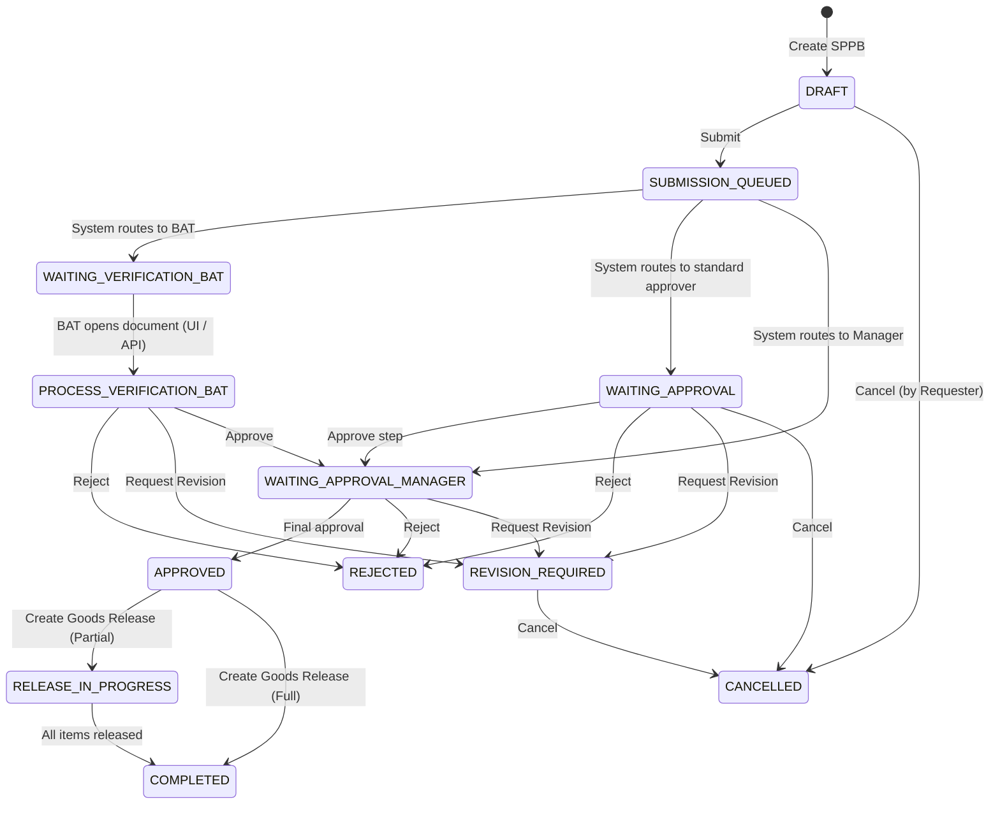

# 04_BUSINESS_RULE_ANALYSIS.md — E-SPPB Enterprise Business Rules Analysis

> **Audit Type:** Business Rules & Workflow Audit (Read-Only)  
> **Project:** E-SPPB Enterprise  
> **Date:** 2026-07-16  

---

## Executive Summary

The business logic centers around the SPPB (Surat Permohonan Pengiriman Barang) lifecycle and its automated routing through an enterprise workflow approval engine. The implementation utilizes a CQRS command model, Spatie roles, and custom resolver logic to determine who must sign off on requests. Let's analyze the exact rules discovered.

---

## SPPB Document Lifecycle & Transitions

---

## Approval Workflow Rules

### 1. Dynamic Routing & Resolving
- When an SPPB is submitted, `WorkflowService` looks up the best match `WorkflowTemplate` by `plant_id`, `department_id`, and `document_type = 'SPPB'`.
- The resolved template contains sequential `WorkflowSteps`.
- For each step, approvers are resolved by `ApproverResolver` using:
  - `USER`: specific user IDs.
  - `ROLE`: Spatie role match.
  - `POSITION`: User positions.
  - `REQUESTER_MANAGER`: The `manager_id` configured directly on the requester's `users` record.
  - `DEPARTMENT_HEAD`: Fallback query targeting users with the `manager` role.
- All resolved candidate users are filtered to enforce that they belong to the same `plant_id` as the document (unless they are a global `super_admin` or have explicit override entries in the `document_accesses` mapping table).

### 2. Approval Modes
- **`ANY` Mode:** A single approval from any resolved candidate user completes the step. Sibling pending approvals are canceled.
- **`ALL` Mode:** All resolved candidate users must approve.

### 3. Self-Approval Guard
- `allow_self_approval` property is defined on `WorkflowStep`. However, in the current `WorkflowService` implementation, no check exists to block a requester from approving their own document if they happen to resolve as a valid approver candidate for a step.

---

## Goods Release & Dispatch Rules

1. **Transaction Triggers:**
   - Goods releases can only be initiated for SPPBs with status `APPROVED` or `RELEASE_IN_PROGRESS`.
2. **Partial vs Full Releases:**
   - The service calculates `quantity - already_released`. If the user tries to release more than the remaining quantity, `InvalidGoodsReleaseQuantityException` is thrown.
   - If the sum of all releases for a detail matches the requested quantity, that detail is marked complete.
   - If all details are complete, the SPPB status transitions to `COMPLETED` and `completed_at` is stamped. Otherwise, status remains `RELEASE_IN_PROGRESS`.

---

## Document Generation & Security

- Generates unique SHA256 tokens per document page for secure public QR code verification.
- Verification checks:
  - Fetches the validation record by token hash.
  - If revoked or expired, verification fails.
  - Logs IP address hash and User-Agent hash to track access trails without storing plain personal data.
