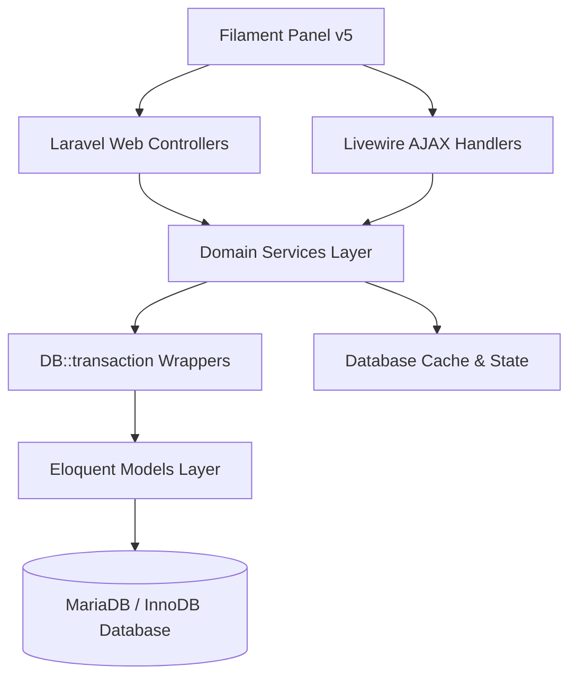

# 08_ARCHITECTURE_SUMMARY.md — E-SPPB Enterprise Architecture Summary

> **Audit Type:** System Architecture Review (Read-Only)  
> **Project:** E-SPPB Enterprise  
> **Date:** 2026-07-16  

---

## Executive Summary

The project is structured around an Enterprise Clean-Domain Architecture within a standard Laravel 12 workspace. System components are divided into layers, keeping business operations decoupled from the user interface.

---

## System Layer Mapping

### 1. Presentation Layer (UI & Controllers)
- **Filament Panels:** Custom admin panel (`AdminPanelProvider`) using Filament v5.6. Provides Indonesian localization.
- **Controllers:** Minimal web controllers handling specific presentation logic (PDF generation triggers and public document validation checks).

### 2. Business Logic & Service Layer
- **Domain Services:** Wrap all transactional workflows. 
- **Command CQRS Store:** `WorkflowCommand` tracks submissions and approvals to ensure idempotency.
- **Tenant Scope:** Handled manually at the service layer by filtering matching query results against the requester's `plant_id`.

### 3. Data & Storage Layer
- **Eloquent Models:** Strict schema mapping, route safety traits (`SecureRouteBinding`), and UUID references.
- **MariaDB Database:** 47 InnoDB tables enforcing database-level constraints.
- **Database Cache & Session Drivers:** Used for application state management.
